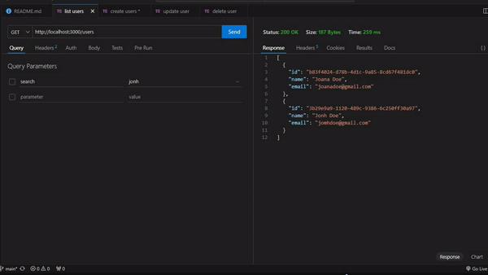

# Node API
Simple node api no framework using native node modules and using local json database

## Reference

 - [Mussinady_dev](https://youtube.com/@abubacar_dev)

## API Documentation

To test this project run:

```bash
npm run dev
```
#### Return all users

`GET http://localhost:3333/users`

#### Return filtered user

`GET http://localhost:3000/users?search=${name}`

| Parameter   | Type       | Description                                   |
| :---------- | :--------- | :------------------------------------------ |
| `name`      | `string` | **Mandatory**. |

#### Create new user

`POST http://localhost:3333/users`

```json 
    {
        "name": "Jonh Doe",
        "email": "jomhdoe@gmail.com"
    }
```

#### Update user

`PUT http://localhost:3333/users/${ID-UUID}`

```json 
    {
        "name": "Jonh Doe Doe",
        "email": "jomhdoedoe@gmail.com"
    }
```

| Parameter   | Type       | Description                                   |
| :---------- | :--------- | :------------------------------------------ |
| `id`      | `string` | **Mandatory**. |

#### Delete user

`DELETE http://localhost:3333/users/${ID-UUID}`

| Parameter   | Type       | Description                                   |
| :---------- | :--------- | :------------------------------------------ |
| `id`      | `string` | **Mandatory**. |

## Appendix

- node version require > v16 (LTS)

## Autor

- [@mussinady-abubcar](https://www.github.com/mussinady-abubcar)

## Tags

[](https://choosealicense.com/licenses/mit/)

## Demonstration



<p align="center"> Developed with ❤️ by Mussinady Abubacar</p>